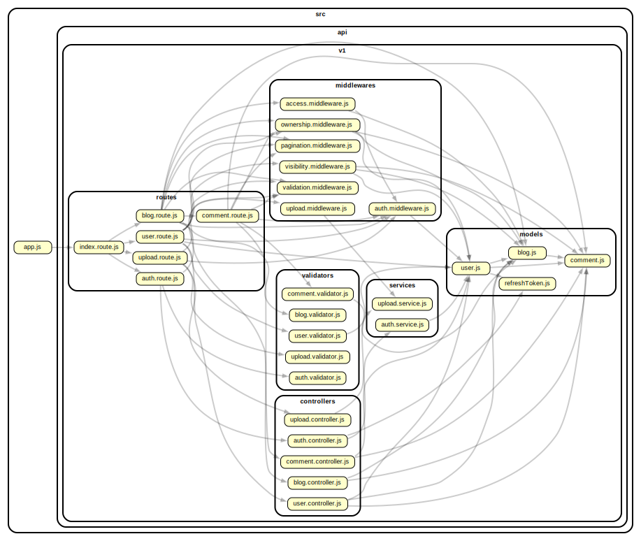
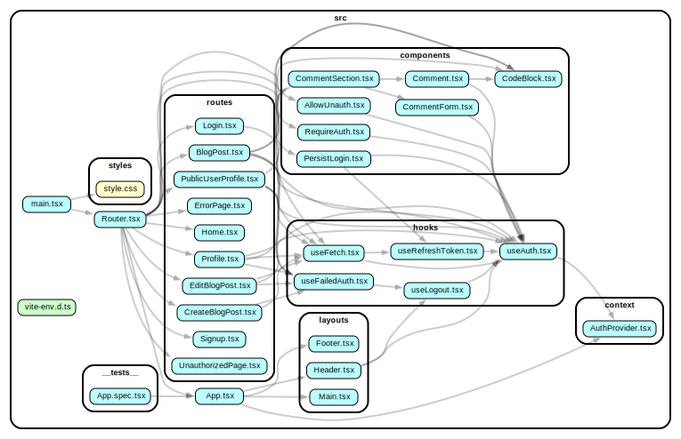
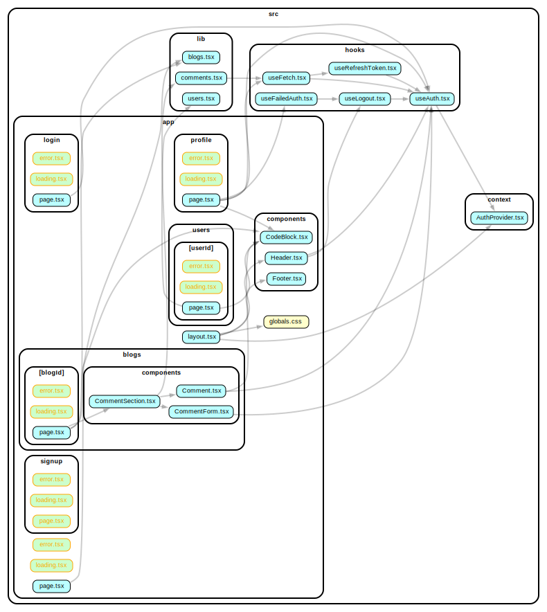

# CodeGeekCentral - Your Ultimate Blogging Platform


-   [Project Overview](#project-overview)
-   [Quick Links](#quick-links)
-   [Backend](#backend)
    -   [API Endpoints](#api-endpoints)
    -   [Technical Details](#technical-details)
-   [Frontend: CodeGeekCentral-CMS](#frontend-codegeekcentral-cms)
    -   [Key Features](#key-features)
-   [Frontend: CodeGeekCentral (Main Site)](#frontend-codegeekcentral-main-site)
    -   [SSR and SEO](#ssr-and-seo)
-   [Upcoming Features](#upcoming-features)
-   [Dependency Graph](#dependency-graph)
    -   [Backend](#backend-dependency)
    -   [CMS](#cms-dependency)
    -   [Main Site](#main-site-dependency)
-   [Contributing](#contributing)
    -   [Setting Up the Development Environment](#setting-up-the-development-environment)
        -   [Backend](#backend-setup)
        -   [CMS](#cms-setup)
        -   [Main Site](#main-site-setup)
-   [Credits](#credits)

## Project Overview

Welcome to CodeGeekCentral, your comprehensive blogging platform that brings together bloggers, readers, and content enthusiasts. CodeGeekCentral is a JAMstack-powered platform, empowers users to share their thoughts, explore exciting content, and engage with the community. Whether you're a seasoned writer or an avid reader, CodeGeekCentral is your go-to destination for all things blogs.

### Quick Links

-   [Main Site](https://codegeekcentral.vercel.app/)
-   [CMS (Content Management System)](https://codegeekcentral-cms.netlify.app/)
-   [API Documentation](https://documenter.getpostman.com/view/27019239/2s9YR3cFq2)

## Backend

CodeGeekCentral's backend is built with Node.js, Express.js, and MongoDB. It offers a set of powerful API endpoints to manage users, blogs, comments, authentication, and file uploads.

### API Endpoints

1. User Endpoint
2. Blogs Endpoint
3. Comments Endpoint
4. Auth Endpoint
5. Upload Endpoint

For detailed information about each endpoint, refer to our [Postman API Documentation](https://documenter.getpostman.com/view/27019239/2s9YR3cFq2).

### Technical Details

-   **Authentication**: Secure authentication with JWT. Refresh tokens are stored in HTTP-only cookies, and access tokens are included in API responses.
-   **Security Measures**: Robust query sanitization, data validation using Express Validator, and cascade delete for dependent Mongoose models.
-   **File Upload**: Utilizes Multer for server-side file processing, validation, and Cloudinary integration for storing and processing images.
-   **Role-Based Access Control (RBAC)**: Assigning roles to users for access control.
-   **Performance**: Implementing indexing for efficient data retrieval. Supports pagination for large datasets.
-   **Hosting**: The server is hosted on [CodeGeekCentral Server](https://codegeekcentral.onrender.com).

## Frontend: CodeGeekCentral-CMS

CodeGeekCentral's Content Management System (CMS) is built with Vite-React, TypeScript, React Router, and Tailwind CSS. It provides a user-friendly interface for bloggers to manage their content and profile.

### Key Features

-   **Routes**: Extensive routing for user authentication, profile management, blog creation, editing, and more.
-   **Validation**: Comprehensive form validation to ensure data integrity and security.
-   **State Management**: Access tokens stored securely in state for protection against XSS and CSRF.
-   **Custom Hooks**: Utilizes custom hooks for improved code organization.
-   **Profile Section**: Supports profile avatar upload with URL or file upload options.
-   **User Access Control**: Strict access control ensures only authors can edit their posts.

## Frontend: CodeGeekCentral (Main Site)

CodeGeekCentral's main site is built with Next.js, offering SEO-friendly routes and features like SSG, ISR, and SSR for optimal performance.

### SSR and SEO

-   **Routes**: Optimized for reading and commenting.
-   **SSG**: Key routes are statically generated for efficient delivery.
-   **Revalidation Time**: Frequent data change routes revalidate every 1 minute, while blogs revalidate every 1 hour.

## Upcoming Features

We have exciting plans for the future, including:

-   **Search and Discovery**: Implement advanced search and discovery functionalities to help users find relevant content.
-   **Featured Section**: Showcase top-rated and handpicked blog posts to provide users with a curated reading experience.

## Dependency Graph

### Backend Dependency



### CMS Dependency



### Main Site Dependency



## Contributing

We welcome contributions from the community! If you'd like to get involved, please follow our [Contribution Guidelines](./CONTRIBUTING.md) to help us improve CodeGeekCentral.

## Setting Up the Development Environment

### Backend Setup

If you intend to work on the backend of CodeGeekCentral, follow these steps:

1. Clone the [CodeGeekCentral repository](https://github.com/karprabha/blog-api):

    ```bash
    git clone https://github.com/karprabha/blog-api
    ```

2. Change your working directory to the backend:

    ```bash
    cd blog-api/backend
    ```

3. Rename the \`**.env.example**\` file to \`**.env**\` and configure the following environment variables:

    ```env
    MONGODB_URI=your_mongodb_uri
    CLOUDINARY_CLOUD_NAME=your_cloudinary_cloud_name
    CLOUDINARY_API_KEY=your_cloudinary_api_key
    CLOUDINARY_API_SECRET=your_cloudinary_api_secret
    JWT_SECRET=your_jwt_secret
    REFRESH_TOKEN_SECRET=your_refresh_token_secret
    ACCESS_TOKEN_EXPIRY=your_access_token_expiry
    REFRESH_TOKEN_EXPIRY=your_refresh_token_expiry
    COOKIE_MAX_AGE=your_cookie_max_age
    NODE_ENV=development
    MORGAN_LOG_FORMAT=dev
    CMS_URI=http://localhost:5173
    CLIENT_URI=http://localhost:5000
    ```

4. Generate new values for JWT_SECRET and REFRESH_TOKEN_SECRET using:

    ```bash
    node -e "console.log(require('crypto').randomBytes(64).toString('hex'))"
    ```

5. To start the development server, run:

    ```bash
    npm run dev
    ```

### CMS Setup

For CMS development, these are the steps:

1. Clone the [CodeGeekCentral repository](https://github.com/karprabha/blog-api):

    ```bash
    git clone https://github.com/karprabha/blog-api
    ```

2. Change your working directory to the CMS frontend:

    ```bash
    cd blog-api/frontend/cms
    ```

3. Rename the \`**.env.example**\` file to \`**.env**\` and set your environment variables:

    ```env
    VITE_API_URI=http://localhost:3000
    VITE_DEMO_USERNAME=your_demo_username
    VITE_DEMO_PASSWORD=your_demo_password
    ```

4. To start the development server, run:

    ```bash
    npm start
    ```

### Main Site Setup

For working on the main site:

1. Clone the [CodeGeekCentral repository](https://github.com/karprabha/blog-api):

    ```bash
    git clone https://github.com/karprabha/blog-api
    ```

2. Change your working directory to the main site frontend:

    ```bash
    cd blog-api/frontend/codegeekcentral
    ```

3. Rename the \`**.env.local.example**\` file to \`**.env.local**\` and configure the following environment variables:

    ```env
    NEXT_PUBLIC_API_URI=http://localhost:3000
    NEXT_PUBLIC_GA_MEASUREMENT_ID=your_ga_measurement_id
    ```

4. To start the server, run:

    ```bash
    npm run dev
    ```

## License

This project is licensed under the MIT License - see the [LICENSE](./LICENSE) file for details.

## Credits

We'd like to express our gratitude to the following resources:

-   **Cloudinary**: We've utilized [Cloudinary](https://cloudinary.com/) to manage files like user avatar.

Your contributions have made this project truly special!
